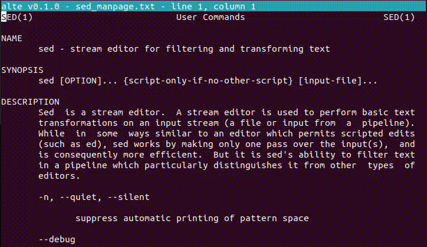

# another limited text editor (alte)

If you want to see this project grow, please :star: it on GitHub.

alte is a minimalistic TUI text editor written entirely in POSIX shell.
alte is meant to be a text editor that can be used even under the worst circumstances (impossibility of installing a text editor on your machine, the only text editor available is hard to use, et cetera).
It is recommended to only use alte in these situations. Otherwise, editors like `nano` are better overall.
alte has been tested with multiple terminals (`sh`, `dash`, `bash`, `zsh`...) on different devices.

:warning: This script is supposed to be used as an emergency text editor. Please acknowledge that some bugs will never be corrected due to several factors, including the limitations of the language. If this is your first time, please read the entirety of this README before any usage.



## Usage

The alte script can be used like a regular shell script. For example, if your current folder contains alte, you can call your terminal and then execute the script:
```
sh alte FILE_NAME
```
You can also use it as an executable or add it to your PATH.
alte requires one argument for the name of the file. There are no parameters implemented.
alte must be executed in a writable folder, since alte will create temporary files to manipulate your text.

## Requirements

alte was written with the assumption that some features of a regular POSIX shell might be unavailable for different reasons. Therefore, alte only uses the most basic utilities available and basic POSiX syntax. This is for example the reason why utilities like `awk` are avoided as long as there is a simpler alternative.
Below is the list of utilities used by alte. If one of these utilities is unavailable on your system, then alte may not work and you will have to find an alternative, either by modifying the source code or by using another script altogether.

```
cat       clear     cut       exit      head      printf
read      rm        sleep     stty      tail      test
touch     tr        trap      true      wc
```

## Commands

To do specific actions in alte, you will need to learn how to use the available commands.
A typical command starts with an exclamation point and is followed by letters and sometimes parameters (`!example arg1 arg2`).
Anything that isn't a command will be added to the text file at the cursor's position.
Some commands can be repeated by pushing enter without inputting anything. For example, if you want to go down 10 lines, you can type `!down` and press enter ten times. The last command will be remembered as long as you do not enter a new repeatable command. This feature is essential in order to use alte efficiently.

:warning: Spaces at the start or end of an input will not be read, this is the reason why the `!space` command exists.

|Command                          |Description                                           |Can be repeated?|
|---------------------------------|------------------------------------------------------|----------------|
|`!up`, `!down`, `!left`, `!right`|Move the cursor                                       |yes             |
|`!nl`, `!space`, `!tab`          |Add a newline, a space or a tabulation                |yes             |
|`!del`                           |Delete the character before the cursor                |yes             |
|`!clear`                         |Erase the current modifications                       |no              |
|`!filename FILE_NAME`            |Change the filename but keep the current modifications|no              |
|`!save`                          |Save modifications for the current file               |no              |
|`!reload`                        |Retrieve the content of the current file              |no              |
|`!nothing`                       |Do nothing (refresh the screen in case of problems)   |no              |
|`!quit` (same as `Ctrl+C`)       |Quit the script (don't forget to save)                |no              |

## License

[WTFPL](http://www.wtfpl.net/)
